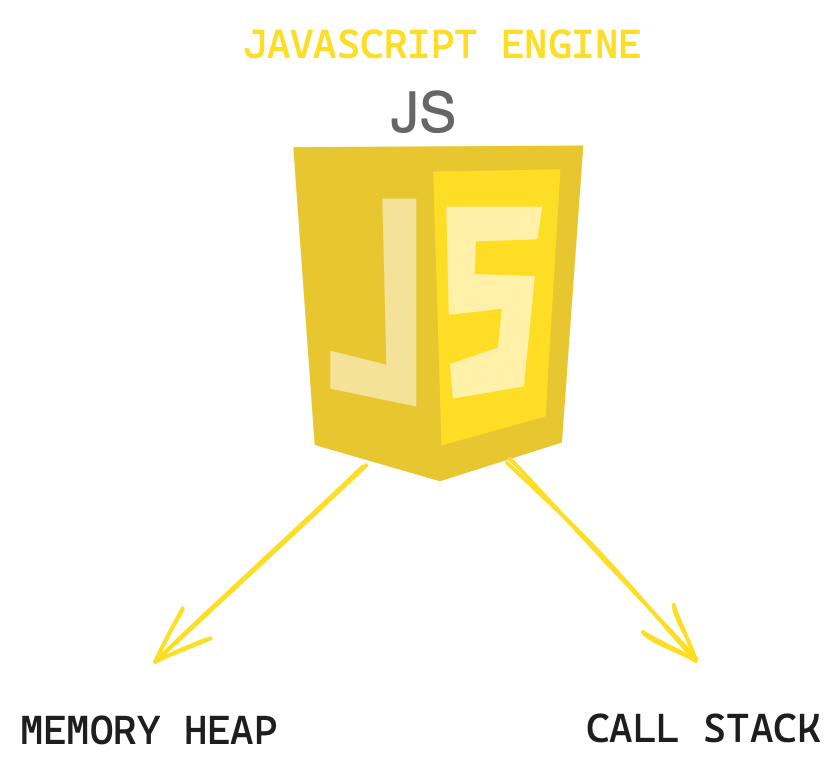

# Javascript

---

## What is a progam :

A program has to do two things

- allocate memory
- parse and execute

## JavaScript Engine

- JavaScript uses a V8 engine, it reads the javaScript that we write and changes into machine executable instruction for the browser



Call stack: <br>
It is part of the machine where it read and executed your code.
<br>
Example:
```javascript
const a = 1;
const a = 'apple';
const a = undefined;
```
Memory heap: <br>
It is part of the machine where it store values that are given to the engine
<br>
Example:
```javascript
console.log(1)
console.log("apple")
console.log(undefined)

```

## Memory Leak
A memory leak in JavaScript occurs when a program (typically a web application) continues to hold onto memory that is no longer needed or referenced. As a result, the application's memory usage gradually increases over time, and it may eventually lead to performance issues or even cause the application to crash.

`note`<br>
That why you might heard that global variable is bad. It is because if you forget to cleanup global variable after usage, it will fill up the memory heap and make the app slowing down or in the worse case not be able to work
